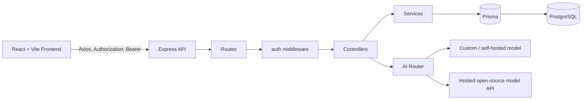

# Architecture

## The Mental Model

Every layer only ever talks to the layer directly below it. Nothing skips
ahead:

```
Frontend → Routes → Controllers → Services → Prisma → Postgres
                                        ↓
                                    AI Router → Provider
```

This means: routes never contain logic, controllers never touch the
database, and services never know *how* a request arrived (HTTP, a script,
a test) — they just do the work. This is what makes the app testable and
lets multiple people work on different layers without stepping on each
other.

## High-Level Overview



## Walkthrough: creating an "example" item, end to end

1. **User clicks "Create"** in a React component. It calls `exampleService.js`
   (frontend), which calls `api.js` (the shared Axios instance) →
   `POST /api/examples` with the payload and an `Authorization: Bearer <token>`
   header.

2. **`backend/src/routes/exampleRoutes.js`** matches the path and method,
   and hands off to `auth` middleware first (verifies the JWT, attaches
   `req.user`), then `validate(createExampleSchema)` (checks the payload
   shape), then the controller. The route file itself contains none of
   this logic — just the wiring.

3. **`backend/src/controllers/exampleController.js`** reads `req.body` and
   `req.user`, calls `exampleService.createExample(...)`, and once it gets
   a result, wraps it in the response envelope (`successResponse(data)`)
   and sends it. It never constructs a SQL query itself.

4. **`backend/src/services/exampleService.js`** is where the actual
   business logic lives — it calls Prisma
   (`prisma.example.create({ data: {...} })`) and returns a plain JS
   object.

5. **Prisma** translates that call into SQL against the `examples` table
   (defined in `backend/db/schema.prisma`, whose shape started life as an
   entry in `contracts/db-schema.md`) and talks to **Postgres**.

6. The response bubbles back up the same chain: service → controller →
   route → Express → Axios → frontend, where `exampleService.js` (frontend)
   hands the parsed response back to whatever component called it.

**Why it's split this way:** if you later add a CLI script or a background
job that also needs to create examples, it calls
`exampleService.createExample()` directly — no HTTP round-trip needed,
because the logic isn't trapped inside a controller.

## Walkthrough: logging in

1. Frontend's `authService.js` posts `{ email, password }` to `/api/auth/login`.
2. `authController.js` calls `authService.js` (backend) — this one does
   the real work: look up the user by email via Prisma, `bcrypt.compare()`
   the password against `passwordHash`, and if it matches, sign an access
   token and a refresh token using helpers in `utils/tokens.js`.
3. A hash of the refresh token gets stored in the `refresh_tokens` table
   so it can be revoked later; the access token is short-lived and never
   touches the database on every request — it's just verified
   cryptographically by `middleware/auth.js` on each subsequent call.
4. Frontend stores both tokens (`context/AppContext.jsx`, backed by
   `localStorage` in this scaffold — swap for something more secure before
   shipping real user data) and attaches the access token to every future
   request via `api.js`'s interceptor, which also retries once through
   `/api/auth/refresh` on a 401.

## Walkthrough: an AI call

1. Frontend calls `aiService.js` → `POST /api/ai/complete` with a prompt.
2. `aiController.js` passes it to `aiRouter.js` — this is the one
   chokepoint every AI call passes through, regardless of which model is
   behind it.
3. `aiRouter.js` looks at the `provider` field (`custom` or `opensource`)
   and delegates to the matching folder in `ai/providers/`, which knows
   how to talk to that specific model server and normalizes its response
   into `{ text, provider, raw }`.
4. If you build an **agent** (multi-step reasoning) or a **classifier**
   (single-shot labeling), those live in `ai/agents` / `ai/classifiers`
   and are built *on top of* `aiRouter` — they never bypass it to call a
   provider directly. That's what makes swapping models later a one-line
   change instead of a rewrite.

## The Role of the Non-Code Folders

- **`contracts/`** isn't decoration — it's what keeps frontend and backend
  from drifting apart. Before you add a column or an endpoint, you write it
  here first, so both sides of the team (or both AI assistants working in
  parallel) are building against the same agreed shape instead of
  discovering a mismatch at integration time.
- **`docs/`** is the "how do I run/deploy/understand this" layer — someone
  joining hour 20 of the hackathon reads `docs/setup.md` and is running in
  five minutes instead of asking you to explain it live.
- **`AGENTS.md`** is specifically for AI coding assistants — it's the
  conventions doc so that whether it's you, a teammate, or Claude/Lovable/
  Copilot generating code, everyone follows the same folder placement and
  naming rules instead of each inventing their own pattern.

## Why the Layering Is Worth the Extra Files

It's tempting in a hackathon to just write the query inside the route
handler. The reason not to: the moment two people need to touch "the
examples feature" simultaneously (one building the UI, one adding a
validation rule), a flat structure means they're editing the same file.
Layered structure means one's in `exampleController.js` and the other's in
`exampleValidator.js` — no merge conflict, no waiting on each other.

## Design Principles

- **Layered, not flat**: routes → controllers → services → Prisma, and
  nothing skips a layer
- **Contract-first**: `contracts/` — especially `db-schema.md` and
  `api.md` — defines shapes before code depends on them
- **Single AI entry point**: all providers behind one router, invoked
  through one route
- **Migrations, not manual schema edits**: `backend/db/migrations/**` is
  generated by Prisma and committed; it's never hand-edited
